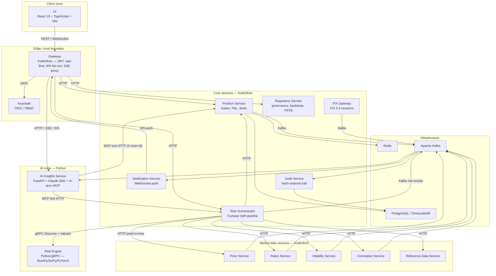

# Kinetix

**Institutional market-risk platform — full trade-to-capital lifecycle, polyglot microservices, AI integrated into the analytics surface.**

Kinetix covers the full risk lifecycle for a multi-asset trading desk: trade capture, hierarchical pre-trade limits, mark-to-market, live intraday P&L with Greek attribution, VaR/ES across three methodologies, options pricing, scenario and reverse-stress testing, regime-adaptive risk parameters, counterparty exposure with PFE and CVA, FRTB Standardised Approach capital, model governance with four-eyes approval, and a SHA-256 hash-chained audit trail. Built as a polyglot microservices monorepo — 12 Kotlin/Ktor services, a Python quantitative engine, and a React trading dashboard — glued together by Kafka, gRPC, and PostgreSQL/TimescaleDB.

On top of that risk surface sits the **Kinetix Copilot** — citation-enforced, [MCP](https://modelcontextprotocol.io/)-backed, sourced entirely from Kinetix's own data. It narrates overnight risk, pushes threshold breaches live, and answers free-form questions in ⌘K. Reads, narrates, cites; never books, hedges, or recommends.

### Where to look next

- [Engineering hallmarks](#engineering-hallmarks) — the architectural decisions that took the most thought.
- [Quant & risk methodology](#quant--risk-methodology) — the financial models behind the calculator.
- [AI features](#ai-features) — explainers, the Copilot, MCP, citation enforcement.
- [Services in depth](#services-in-depth) — what each service owns and the interesting parts.
- [Architectural decision records](docs/adr/README.md) — every architectural choice, indexed.
- [Allium specifications](specs/README.md) — the behavioural specs that drive code and tests.

## At a glance

| | |
|---|---|
| **Services** | 12 Kotlin/Ktor microservices on JVM 21 + Python risk engine + Python `ai-insights-service` |
| **Risk engine** | Python 3.12 — NumPy, SciPy, PyTorch — exposes 11 gRPC services |
| **AI** | Python `ai-insights-service` (FastAPI) on top of the Claude Agent SDK, in-process MCP server, citation-enforced narratives ([ADR-0036](docs/adr/ADR-0036-ai-copilot-architecture.md)) |
| **Frontend** | React 19 + TypeScript dashboard, 11 trader/risk tabs |
| **Datastores** | PostgreSQL 17 / TimescaleDB (database-per-service), Redis 7 |
| **Messaging** | Apache Kafka 3.9 (KRaft) — 20 production topics with per-topic DLQs |
| **Schema** | 173 Flyway migrations across 11 service schemas |
| **Behavioural specs** | 24 [Allium v3](https://github.com/juxt/allium) specifications |
| **Architecture decisions** | 36 ADRs in [`docs/adr/`](docs/adr/) |
| **Tests** | 915 — 561 Kotlin (Kotest) · 79 Python (pytest) · 191 Vitest · 84 Playwright |
| **Observability** | Prometheus, Grafana, Loki, Tempo, OpenTelemetry |
| **Quality gates** | Coverage ratchet, mutation testing (Stryker, mutmut), property-based tests (Hypothesis), Gatling load tests |

## Architecture



> Rendered from [`docs/diagrams/c4-container.md`](docs/diagrams/c4-container.md). The full diagram set — context, Kafka topology, risk-flow sequence, data flows, AI copilot, auth, deployment — lives under [`docs/diagrams/`](docs/diagrams/README.md).

Each Kotlin service owns its own PostgreSQL schema (ADR-0011), communicates with peers via Kafka (ADR-0004) or HTTP through the gateway (ADR-0012), and crosses the language boundary to the Python risk engine via a unified valuation gRPC contract (ADR-0024, ADR-0029). The risk engine is a **pure calculator**: the orchestrator owns all market-data discovery and fetching, so risk runs are deterministic, replayable, and free of hidden I/O (ADR-0029, ADR-0018).

## Engineering hallmarks

The pieces that took the most thought are documented under [`docs/adr/`](docs/adr/). The ones worth surfacing:

- **Discovery–valuation two-phase contract** ([ADR-0029](docs/adr/0029-discovery-valuation-two-phase-contract.md), [ADR-0024](docs/adr/0024-unified-valuation-rpc.md)) — risk-engine is a stateless function `(positions, market-data, seed) → results`. All data discovery and fetching is orchestrator-side. Combined with run manifests ([ADR-0018](docs/adr/0018-run-reproducibility-via-manifests.md)) this lets us replay any VaR run bit-for-bit from the captured inputs.
- **Hash-chained, tamper-evident audit trail** ([ADR-0017](docs/adr/0017-hash-chained-audit-trail.md)) — every audit event embeds `SHA-256(payload || previous_hash)`. A row-level `pg_advisory_xact_lock` serialises chain writes so concurrent producers can never fork the chain. Seven-year retention on TimescaleDB hypertables.
- **Six-level hierarchical limits** ([ADR-0023](docs/adr/0023-hierarchical-limit-management.md)) — pre-trade checks roll up Firm → Division → Desk → Book → Trader → Counterparty in a single pass. Temporary limit increases are first-class entities with their own approval workflow.
- **EOD promotion governance** ([ADR-0019](docs/adr/0019-official-eod-labeling-with-promotion-governance.md)) — only fully completed runs can become `OFFICIAL_EOD`. Promotion is a separate, audited action with a four-eyes rule. Reports and regulatory submissions reference frozen promoted runs, not whichever scheduled run happened to finish last.
- **Regime-adaptive VaR parameters** — a rule-based classifier (NORMAL / ELEVATED_VOL / CRISIS / RECOVERY) with debounced transitions auto-selects calculation method, confidence level, and time horizon. Behaviour on degraded inputs is explicitly specified ([ADR-0034](docs/adr/0034-regime-degraded-signal-policy.md)): a transition only fires when both available signals agree.
- **FIX gateway extraction** ([ADR-0035](docs/adr/0035-fix-gateway-service-extraction.md)) — venue/FIX-protocol concerns isolated in a dedicated service so position-service can stay focused on state. Inbound execution reports flow over Kafka; outbound `NewOrderSingle` is a synchronous gRPC.
- **Backward-compatible Flyway migrations** ([ADR-0025](docs/adr/0025-flyway-backward-compatible-migrations.md), [ADR-0027](docs/adr/0027-database-migration-practices.md)) — expand-contract split across two releases, transaction-incompatible statements (e.g. `CREATE INDEX CONCURRENTLY`) caught at review, rollback files alongside every migration.
- **DLQ + circuit breaker resilience** ([ADR-0014](docs/adr/0014-resilience-patterns-dlq-circuit-breaker.md)) — every Kafka consumer wraps in a `RetryableConsumer` with bounded retries and per-topic DLQs. Inter-service HTTP calls are guarded by circuit breakers.
- **Correlation IDs end-to-end** ([ADR-0022](docs/adr/0022-correlation-id-propagation.md)) — a UUID `correlationId` flows through every Kafka header and HTTP request so a single trace links UI click → API call → Kafka event → risk run → audit row.

## Quant & risk methodology

| Capability | Method | Implementation |
|---|---|---|
| **VaR — Parametric** | Delta-Normal | `risk-engine/src/kinetix_risk/var_parametric.py` |
| **VaR — Historical** | Empirical, sqrt-of-time scaling | `var_historical.py` |
| **VaR — Monte Carlo** | 10K paths, antithetic variates | `var_monte_carlo.py` |
| **Expected Shortfall** | CVaR at 97.5% (Basel FRTB) | `expected_shortfall.py` |
| **Cross-book VaR** | Multi-book aggregation with correlation matrices, hierarchy roll-up | `cross_book_var.py` + `ScheduledCrossBookVaRCalculator.kt` |
| **Greeks — analytical** | Black-Scholes-Merton (Δ, Γ, ν, Θ, ρ) with continuous dividend yield | `black_scholes.py` |
| **Cross-Greeks** | Vanna, Volga, Charm — analytical BSM | `greeks.py` |
| **Bond pricing** | DV01, key rate durations across 4-tenor internal grid; 12-tenor FRTB GIRR extension ([ADR-0028](docs/adr/0028-key-rate-duration-tenor-buckets.md)) | `bond_pricing.py`, `key_rate_duration.py` |
| **Swap pricing** | Discount-curve based IRS valuation | `swap_pricing.py` |
| **P&L attribution** | Greek decomposition (Δ, Γ, ν, Θ, ρ, unexplained); pricing-Greek source ([ADR-0032](docs/adr/0032-intraday-pnl-greek-source.md)) | `attribution_server.py`, `PnLAttributionDeriver.kt` |
| **Brinson attribution** | Allocation vs. selection decomposition | `brinson.py` |
| **Factor risk** | Five systematic factors (equity β, rates duration, credit spread, FX delta, vol exposure) — OLS and analytical loadings | `factor_model.py`, `factor_server.py` |
| **Historical replay** | GFC 2008, COVID 2020, Taper Tantrum 2013, Euro Crisis 2011 | `historical_replay.py` |
| **Reverse stress** | Minimum-norm SLSQP solver — smallest shock producing a target loss | `reverse_stress.py` |
| **Custom scenarios** | Multi-factor parametric shocks, correlation override, liquidity stress | `stress_server.py`, scenario governance pipeline |
| **FRTB SBM** | Sensitivities-Based Method — GIRR, equity, FX, commodity, credit spread; bucket correlations per Basel | `frtb/sbm.py`, `frtb/girr_correlations.py` |
| **FRTB DRC** | Default Risk Charge — credit-rating PDs, seniority LGD, maturity weighting, sector concentration | `frtb/drc.py`, `frtb/drc_enhanced.py` |
| **FRTB RRAO** | Residual Risk Add-On for exotics | `frtb/rrao.py` |
| **SA-CCR** | Standardised Approach to Counterparty Credit Risk | `sa_ccr.py`, `sa_ccr_server.py` |
| **Counterparty PFE** | Monte Carlo, 95th/99th percentile across tenor buckets | `credit_exposure.py`, `counterparty_risk_server.py` |
| **CVA** | Discrete approximation using CDS-implied or Basel default probabilities | `credit_exposure.py` |
| **Wrong-way risk** | Sector-match taxonomy ([ADR-0031](docs/adr/0031-wrong-way-risk-sector-taxonomy.md)) | `counterparty_risk_server.py` |
| **VaR backtesting** | Kupiec POF + Christoffersen independence; Basel traffic-light zones | `backtesting.py` |
| **Vol surface diff** | Bilinear interpolation in (log K, √T) ([ADR-0033](docs/adr/0033-vol-surface-diff-method.md)) | `volatility.py` |
| **Regime detection** | Rule-based classifier with debounced transitions; degraded-input policy ([ADR-0034](docs/adr/0034-regime-degraded-signal-policy.md)) | `regime_detector.py`, `ScheduledRegimeDetector.kt` |
| **Hedge optimisation** | Constrained optimiser minimising target Greeks / VaR, with cost model | `hedge_optimizer.py` |
| **ML — anomaly detection** | Isolation Forest on price/vol streams | `ml/anomaly_detector.py` |
| **ML — vol forecasting** | LSTM (PyTorch) | `ml/vol_predictor.py` |
| **ML — credit PD** | Neural net classifier | `ml/credit_model.py` |

## AI features

LLM-powered analytics built *into* the platform — not bolted on. The AI surface reads from Kinetix's own data through a typed contract, cites every number it returns, and is blocked from giving advice. Reads, narrates, cites; never books, hedges, or recommends.

**v1 — shipped**

- **VaR Explainer** — click **Explain** on the Risk tab's VaR gauge for a narrative walk-through plus the top contributors.
- **AI Commentary** — every generated Report renders an AI Commentary card summarising drivers and limit breaches.

**v2 — in flight ([ADR-0036](docs/adr/ADR-0036-ai-copilot-architecture.md))**

The Kinetix Copilot — morning brief, intraday push, ⌘K — runs over an in-process [Model Context Protocol](https://modelcontextprotocol.io/) server exposing read-only Kinetix tools, with a citation contract that requires every numeric token to declare its source and a server-side policy guard that blocks advisory language. Write actions remain out of scope by design.

Full architecture — MCP tools, citation contract, policy guard, demo-mode client — lives in the [AI Insights Service](#ai-insights-service) block further down. Ongoing work is tracked in [`plans/ai-v2.md`](plans/ai-v2.md); a longer-form walkthrough lives in the [AI Features wiki page](docs/wiki/AI-Features.md).

## Services

| Service | Language | Responsibilities |
|---|---|---|
| **Gateway** | Kotlin | REST/WebSocket aggregation, Keycloak JWT, rate limiting, role-based access (`ADMIN`, `TRADER`, `RISK_MANAGER`, `COMPLIANCE`, `VIEWER`) |
| **Position Service** | Kotlin | Trade book/amend/cancel with idempotent processing, six-level hierarchical limits, real-time positions, realised P&L, prime broker reconciliation, counterparty exposure |
| **Price Service** | Kotlin | Market-data ingestion, TimescaleDB hypertable storage with continuous aggregates, Redis caching, Kafka publishing |
| **Rates Service** | Kotlin | Risk-free curves, forward curves, yield curve anomaly detection |
| **Volatility Service** | Kotlin | Volatility surfaces with bilinear (log K, √T) interpolation |
| **Correlation Service** | Kotlin | Correlation matrices with Ledoit-Wolf shrinkage |
| **Reference Data Service** | Kotlin | Instruments (11 sealed-interface subtypes), org hierarchy, counterparties, credit ratings, dividend yields, credit spreads |
| **Risk Orchestrator** | Kotlin | Five-phase risk pipeline (positions → discover → fetch → valuate → publish), cross-book aggregation, P&L attribution, what-if engine, EOD promotion, SOD baselines, scheduled regime detection |
| **Regulatory Service** | Kotlin | FRTB Standardised Approach, VaR backtesting, model registry with four-stage lifecycle, regulatory submissions with four-eyes approval, XBRL/CSV templates |
| **Audit Service** | Kotlin | Hash-chained immutable audit trail, DLQ replay, 7-year TimescaleDB retention |
| **Notification Service** | Kotlin | Alert rule engine (13 alert types), debounced/deduplicated delivery via in-app/email/webhook/PagerDuty, escalation, anomaly subscriptions |
| **Fix Gateway** | Kotlin | FIX 4.4 venue connectivity, `NewOrderSingle`/`ExecutionReport` lifecycle, session reconciliation, mass-cancel-on-disconnect ([ADR-0035](docs/adr/0035-fix-gateway-service-extraction.md)) |
| **Risk Engine** | Python | Stateless gRPC calculator: VaR (3 methods), ES, Greeks, BSM/bond/swap pricing, FRTB SBM/DRC/RRAO, SA-CCR, factor model, regime classifier, reverse stress, ML services |
| **AI Insights Service** | Python | FastAPI on port 8095 wrapping the Claude Agent SDK. v1 explainers (`/api/v1/insights/explain/var`, `/api/v1/insights/explain/report`) plus the v2 Copilot foundation — in-process MCP server (port 8096) with 10 read-only Kinetix tools, `Citation` contract, banned-phrase policy guard, and a deterministic canned client for `DEMO_MODE=true` ([ADR-0036](docs/adr/ADR-0036-ai-copilot-architecture.md)) |
| **UI** | TypeScript | React 19 trading + risk dashboard — 11 tabs in three clusters (Trading, Risk, Ops), workspaces with saved views, WCAG 2.1 accessibility, dark mode, CSV export, WebSocket streaming, `AIInsightPanel` rendering insights with mode badge |

## Services in depth

Each service owns one domain and exposes a narrow contract to its neighbours. Below: what it owns, what's interesting from a market-risk *and* engineering perspective, and how it wires into the rest of the platform.

### Gateway

**What it owns:** Single ingress for the UI — REST aggregation, WebSocket fan-out for live risk events, JWT validation, role-based access, per-user rate limiting.

**What's interesting**

- **Five-role access model** (`ADMIN`, `TRADER`, `RISK_MANAGER`, `COMPLIANCE`, `VIEWER`) enforced at the route level rather than in each downstream service — risk reads and trade writes share an auth boundary instead of drifting apart.
- **WebSocket fan-out** runs one Kafka consumer per topic in the gateway, multiplexed to many subscribers per user session. Position, intraday P&L, and limit breaches stream live without each downstream service maintaining its own socket layer.
- **Correlation IDs minted at ingress** ([ADR-0022](docs/adr/0022-correlation-id-propagation.md)) propagate through every Kafka header and HTTP call, so a single trace links UI click → API → Kafka event → risk run → audit row.

**How it connects:** Fronts every Kotlin service over HTTP; consumes `risk.results`, `risk.pnl.intraday`, `limits.breaches`, `risk.regime.changes` for WebSocket push.

### Position Service

**What it owns:** Trade lifecycle (book / amend / cancel), real-time position aggregation, six-level pre-trade limit enforcement, realised P&L, prime-broker reconciliation, counterparty exposure.

**What's interesting**

- **Six-level hierarchical pre-trade limits** — `Firm → Division → Desk → Book → Trader → Counterparty` — evaluated in a single pass over a cached hierarchy snapshot ([ADR-0023](docs/adr/0023-hierarchical-limit-management.md)). Temporary limit increases are first-class entities with their own four-eyes approval workflow.
- **Idempotent trade processing** keyed on `(clientOrderId, version)` — at-least-once Kafka redelivery is provably safe, and trade amendments compose cleanly with the lifecycle event stream.
- **Prime-broker reconciliation** with automated break detection — every cycle writes audit-chain entries, so a discrepancy is forensic, not anecdotal.
- **Execution lifecycle decoupled from venue connectivity** ([ADR-0035](docs/adr/0035-fix-gateway-service-extraction.md)) — fix-gateway delivers `ExecutionReport`s over Kafka, leaving position-service focused on state rather than session management.

**How it connects:** Publishes `trades.lifecycle`; consumes `execution.reports`, `price.updates`; queried by risk-orchestrator over HTTP; calls fix-gateway over gRPC for outbound orders.

### Price Service

**What it owns:** Market-data ingestion, tick-and-bar history, snapshot lookups.

**What's interesting**

- **TimescaleDB hypertables** for tick data with continuous aggregates pre-computing OHLC at multiple resolutions — historical replay queries hit pre-aggregated rows instead of raw ticks.
- **Redis hot path** for last-price lookups; cold reads fall through to TimescaleDB. The pricing call from the risk engine is sub-millisecond on the warm path.
- **Stale-feed detection** at the ingestion edge — a stalled feed surfaces on `risk.anomalies` before it ever reaches a VaR calculation, breaking the "we calculated yesterday's risk on yesterday's prices" failure mode.
- **Isolation Forest anomaly detection** runs in the risk engine over gRPC, scoring incoming ticks for jumps and decoupled moves.

**How it connects:** Publishes `price.updates`; gRPC client of risk-engine for anomaly scoring; ingests from external venues.

### Rates Service

**What it owns:** Risk-free zero curves, forward curves, yield-curve anomaly detection.

**What's interesting**

- **Bootstrapped zero curves** from money-market, futures, and swap inputs per major currency — the foundation for swap, bond, and rate-scenario pricing.
- **Forward curve construction** sits behind a clean interface so the curve can be replayed exactly as it stood at any historical point — required for run reproducibility ([ADR-0018](docs/adr/0018-run-reproducibility-via-manifests.md)).
- **Yield-curve anomaly detection** (inversions, kinks, parallel jumps) feeds the regime classifier so a curve regime shift is one of the signals that flips Kinetix between `NORMAL`, `ELEVATED_VOL`, `CRISIS`, and `RECOVERY`.

**How it connects:** Publishes rate-curve updates; queried by risk-orchestrator and regulatory-service.

### Volatility Service

**What it owns:** Per-instrument implied volatility surfaces.

**What's interesting**

- **Bilinear interpolation in `(log K, √T)`** ([ADR-0033](docs/adr/0033-vol-surface-diff-method.md)) — the right coordinate space for vol surfaces, where the smile is approximately linear in `log K` and term-structure approximately linear in `√T`. Naive `(K, T)` interpolation is a quiet source of mispricing for OTM options.
- **Surface diffing** produces a deterministic, comparable representation — drives surface-shift scenarios, vega-bucket reporting, and what-if analysis.
- **Per-instrument granularity** rather than a single global surface — necessary for single-name equity options where each underlying has its own smile dynamics.

**How it connects:** Publishes surface updates; queried by risk-engine for every option pricing call.

### Correlation Service

**What it owns:** Asset-asset correlation matrices.

**What's interesting**

- **Ledoit-Wolf shrinkage** keeps correlation estimates well-conditioned for the linear-algebra heavy paths — parametric VaR, cross-book aggregation, and factor model inversion all need invertible matrices.
- **Rolling-window estimation with regime-aware refresh** — when the regime classifier flips, the correlation engine re-fits rather than waiting for the window to roll. Crisis correlations look nothing like normal-regime correlations; the platform reflects that within minutes, not days.

**How it connects:** Publishes correlation matrix updates; input to parametric VaR and cross-book VaR in the risk engine.

### Reference Data Service

**What it owns:** Instruments, organisational hierarchy, counterparties, credit ratings, dividend yields, credit spreads.

**What's interesting**

- **11 sealed-interface instrument subtypes** ([ADR-0020](docs/adr/0020-sealed-interface-instrument-type-hierarchy.md)) — equity, bond, FX spot/forward, vanilla swap, vanilla option, swaption, CDS, and more. Consumers pattern-match exhaustively; adding a new instrument type breaks the build everywhere it must be handled.
- **Six-level org hierarchy** stored as a tree (`Firm → Division → Desk → Book → Trader → Counterparty`) — single source of truth for both pre-trade limit roll-up in position-service *and* VaR aggregation in risk-orchestrator.
- **Counterparty entity** carries credit rating, sector taxonomy, and credit spread — feeds wrong-way risk classification ([ADR-0031](docs/adr/0031-wrong-way-risk-sector-taxonomy.md)), CVA, PFE, and SA-CCR. One canonical counterparty record, many risk lenses.

**How it connects:** Single-writer; queried by virtually every service over HTTP.

### Risk Orchestrator

**What it owns:** Five-phase risk pipeline, cross-book aggregation, P&L attribution, what-if engine, EOD promotion, SOD baselines, scheduled regime detection.

**What's interesting**

- **Five-phase pipeline** ([ADR-0021](docs/adr/0021-risk-orchestration-architecture.md)) — `positions → discover → fetch → valuate → publish`. Orchestration and calculation are cleanly separated: the risk engine never makes a market-data call.
- **Deterministic run manifests** ([ADR-0018](docs/adr/0018-run-reproducibility-via-manifests.md)) capture every input — positions, prices, rates, vols, correlations, seeds, model versions. Any VaR run can be replayed bit-for-bit months later for backtesting, model validation, or regulator queries.
- **EOD promotion is a separate, audited four-eyes action** ([ADR-0019](docs/adr/0019-official-eod-labeling-with-promotion-governance.md)) — reports and regulatory submissions reference frozen promoted runs, not whichever scheduled run happened to finish last.
- **Cross-book aggregation** rolls up VaR across the full six-level hierarchy with correlation matrices; supports VaR budgeting and marginal contribution analysis — a trader can see how much VaR their next order will *cost* before sending it.
- **Intraday P&L with Greek attribution** ([ADR-0032](docs/adr/0032-intraday-pnl-greek-source.md)) decomposes every move into `Δ · ΔS + ½Γ · ΔS² + ν · Δσ + Θ · Δt + ρ · Δr + unexplained`, sourced from pricing-time Greeks for consistency.
- **Scheduled regime classifier** (`NORMAL`, `ELEVATED_VOL`, `CRISIS`, `RECOVERY`) auto-adapts VaR method, confidence, and horizon with debounced transitions and an explicit degraded-signal policy ([ADR-0034](docs/adr/0034-regime-degraded-signal-policy.md)) — a flip only fires when both available signals agree.

**How it connects:** Publishes `risk.results`, `risk.cross-book-results`, `risk.pnl.intraday`, `risk.official-eod`, `risk.regime.changes`; gRPC client of risk-engine; HTTP client of position-, price-, rates-, volatility-, correlation-, reference-data-service.

### Regulatory Service

**What it owns:** FRTB Standardised Approach (SBM / DRC / RRAO), VaR backtesting, model registry, regulatory submissions.

**What's interesting**

- **Full FRTB SBM** — GIRR across a 12-tenor bucket structure ([ADR-0028](docs/adr/0028-key-rate-duration-tenor-buckets.md)), equity, FX, commodity, credit spread; bucket and cross-bucket correlations per the Basel parameter set.
- **DRC** (Default Risk Charge) with rating-based PDs, seniority-driven LGD, maturity weighting, and sector concentration — the parts of FRTB capital that punish unhedged credit exposure.
- **RRAO** (Residual Risk Add-On) for exotics that don't fit cleanly into SBM sensitivities.
- **VaR backtesting** with Kupiec POF + Christoffersen independence tests, mapped to Basel traffic-light zones (green / yellow / red) — every official EOD VaR gets a backtest verdict.
- **Four-stage model lifecycle** (`DRAFT → CHALLENGER → CANDIDATE → PRODUCTION`) with documented promotion gates and four-eyes approval at each transition.
- **Submissions as XBRL/CSV templates** — every submission is anchored in a frozen EOD run so a regulator question can be traced back to exact inputs.

**How it connects:** Consumes `risk.official-eod`; queries reference-data-service for instrument and counterparty data.

### Audit Service

**What it owns:** Hash-chained immutable audit trail for every state-changing action across the platform.

**What's interesting**

- **`SHA-256(payload ‖ previous_hash)` per entry** ([ADR-0017](docs/adr/0017-hash-chained-audit-trail.md)) — tamper detection is constant-time on any prefix, and any insertion breaks every subsequent hash.
- **Row-level `pg_advisory_xact_lock` serialises chain writes** so concurrent producers can never fork the chain. The chain has one effective writer at the database layer regardless of how many services publish events.
- **DLQ replay tooling** — failed audit writes drain into a DLQ topic and replay through the same path; the chain never develops a gap, and gap-free is the only useful invariant for a regulator.
- **Seven-year TimescaleDB retention** with explicit retention policies and compression — designed for the lifetime of a regulatory exam, not the lifetime of a deployment.

**How it connects:** Consumes `kinetix.audit.chain` and `governance.audit`; queried by regulatory-service for submission anchoring.

### Notification Service

**What it owns:** Alert rule engine, multi-channel delivery, escalation.

**What's interesting**

- **13 alert types** covering limit breaches, anomalies, regime changes, regulatory deadlines, EOD completion, audit gaps — the platform's failure modes have first-class names.
- **Debounce + dedup** in the rule engine — repeat fires within a window are suppressed, and identical fires across channels are collapsed so a breach doesn't page four times.
- **Multi-channel delivery** — in-app, email, webhook, PagerDuty — with per-rule channel routing. Compliance alerts go to compliance; PagerDuty is reserved for genuine production breaks.
- **Escalation chains** for unacknowledged critical alerts; **anomaly subscriptions** let individual traders watch specific instruments or desks without spamming the desk channel.

**How it connects:** Consumes `limits.breaches`, `risk.anomalies`, `risk.regime.changes`; pushes through the gateway WebSocket for in-app delivery.

### Fix Gateway

**What it owns:** FIX 4.4 connectivity to venues and prime brokers.

**What's interesting**

- **Extracted from position-service** ([ADR-0035](docs/adr/0035-fix-gateway-service-extraction.md)) so venue and protocol concerns live behind a clean boundary — position-service can stay focused on state, fix-gateway can stay focused on sessions.
- **Asymmetric transport** — outbound `NewOrderSingle` flows over synchronous gRPC because the caller needs a confirmation; inbound `ExecutionReport` flows over Kafka because the platform fan-out is many-to-many.
- **Session reconciliation on reconnect with mass-cancel-on-disconnect** — a session drop never leaves working orders unattended at a venue.

**How it connects:** gRPC server for position-service; publishes `execution.reports`; maintains FIX 4.4 sessions to external venues.

### Risk Engine

**What it owns:** Stateless quantitative calculator exposing 11 gRPC services.

**What's interesting**

- **Pure function `(positions, market-data, seed) → results`** ([ADR-0024](docs/adr/0024-unified-valuation-rpc.md), [ADR-0029](docs/adr/0029-discovery-valuation-two-phase-contract.md)) — no I/O, no database, no market-data discovery. Replayable from any captured manifest, parallelisable horizontally, and trivially testable.
- **Three VaR methodologies** — Parametric Delta-Normal, Historical with square-root-of-time scaling, Monte Carlo (10K paths, antithetic variates) — plus Expected Shortfall at 97.5% per Basel FRTB.
- **Greeks via analytical Black-Scholes-Merton** with continuous dividend yield — Δ, Γ, ν, Θ, ρ — plus the cross-Greeks Vanna, Volga, Charm that matter for vol-trader books.
- **Reverse stress solver** — SLSQP-driven minimum-norm shock that produces a target loss. Answers the question traders actually ask: *what's the smallest plausible move that breaks me?*
- **FRTB SBM / DRC / RRAO, SA-CCR, factor model, regime classifier** — every regulatory and adaptive risk calculation lives in one engine, so behaviour is consistent across the platform.
- **ML services** — Isolation Forest for price/vol anomaly detection, LSTM (PyTorch) for vol forecasting, neural-net classifier for credit PD. ML is a service surface, not a separate platform.

**How it connects:** gRPC server only — never reaches outward. Called by risk-orchestrator and (for anomaly detection) by price-service.

### AI Insights Service

**What it owns:** LLM-powered explainers and the Kinetix Copilot foundation — narratives that are auditable, cite their sources, and refuse to give advice.

**What's interesting**

- **Routes through the host's Claude Code subscription** via the Claude Agent SDK (Python) — no `ANTHROPIC_API_KEY`, no per-token spend, host credentials never leave the box.
- **v1 explainers** — `POST /api/v1/insights/explain/var` and `/explain/report` return `{narrative, bullets, model, mode}` so the UI can render a *Demo mode* badge when the SDK isn't reachable.
- **In-process MCP server** ([ADR-0036](docs/adr/ADR-0036-ai-copilot-architecture.md)) on internal port 8096 with ten read-only Kinetix tools: `get_book_var`, `get_positions`, `get_greeks_summary`, `get_limit_utilisation`, `get_pnl_attribution`, `get_vol_surface`, `get_stress_scenarios`, `get_correlation_matrix`, `get_active_alerts`, `get_market_data_snapshot`. The Copilot reasons over Kinetix's own data, not a fine-tuned snapshot.
- **Citation contract** — every numeric token in a response must carry `{tool, params, result_field, result_value, as_of_timestamp, data_source, freshness_seconds}`. Uncited numbers are a contract violation, not a stylistic preference.
- **Server-side policy guard** rejects advisory language (`you should`, `i recommend`, `consider hedging`, …) with `POLICY_VIOLATION`. The Copilot reads, narrates, and cites; it never books, hedges, or recommends.
- **Deterministic canned client for `DEMO_MODE=true`** — CI, Playwright, and any public demo run end-to-end against scripted responses, so the AI surface stays testable.

**How it connects:** HTTP behind the gateway at `/api/v1/insights/*`; the MCP server is in-process and not exposed externally.

### UI

React 19 + TypeScript trading and risk dashboard — 11 tabs in three clusters (Trading, Risk, Ops), workspaces with saved views, WCAG 2.1 AA accessibility, dark mode, CSV export, WebSocket streaming for live position / P&L / limit pushes, and `AIInsightPanel` rendering insights with the mode badge. Full tab-by-tab breakdown lives in [`ui/README.md`](ui/README.md).

## Behavioural specifications

The platform's intended behaviour is formally specified in 24 [Allium v3](https://github.com/juxt/allium) files under [`specs/`](specs/). Each spec declares entities with lifecycle transition graphs, state-dependent field presence, rules with pre/post-conditions, and invariants — design documentation and a verifiable contract in one.

| Spec | Domain |
|---|---|
| `trading.allium` | Trade booking, amend, cancel; event publishing |
| `positions.allium` | Position aggregation, MTM, realised P&L |
| `execution.allium` | Order lifecycle, FIX integration, fill processing |
| `limits.allium` | Six-level hierarchy, pre-trade checks, temporary increases |
| `risk.allium` | VaR/ES, Greeks, cross-book aggregation, EOD promotion |
| `risk-models.allium` | Quantitative model contracts (VaR, BSM, bond/swap, stress, FRTB) |
| `intraday-pnl.allium` | Streaming intraday P&L with Greek attribution |
| `discovery-valuation.allium` | Two-phase risk-engine contract |
| `hierarchy-risk.allium` | Multi-desk roll-up, VaR budgeting, marginal contribution |
| `factor-model.allium` | Systematic risk decomposition |
| `scenarios.allium` / `scenario-lifecycle.allium` | Historical replay, reverse stress, governance workflow |
| `regime.allium` | Market regime detection and adaptation |
| `regulatory.allium` | Model governance, backtesting, submissions, FRTB |
| `audit.allium` | Hash-chained audit invariants |
| `counterparty-risk.allium` | PFE, CVA, netting sets, wrong-way risk |
| `liquidity.allium` | LVaR, concentration, stressed liquidation |
| `hedge.allium` | Constrained hedge optimisation |
| `alerts.allium` / `alert-escalation.allium` | Alert rule engine and escalation |
| `eod-close.allium` | Automatic EOD trigger and promotion |
| `market-data.allium` | Price, rate, vol, correlation ingestion |
| `reference-data.allium` | Instruments, org hierarchy, users, benchmarks |
| `core.allium` | Shared value types (Money, TimeRange, CurvePoint) |

## Tech stack

| Layer | Technology |
|---|---|
| Languages | Kotlin 2.1 (JVM 21), Python 3.12, TypeScript 5.9 |
| Backend framework | Ktor 3.1, Koin, Kotlinx Serialization, Exposed 0.58 ORM |
| Risk engine | NumPy, SciPy, PyTorch 2.2, scikit-learn |
| AI | Claude Agent SDK (Python), FastAPI, Model Context Protocol (in-process server), Pydantic — host `~/.claude/` subscription, no `ANTHROPIC_API_KEY` |
| Frontend | React 19, Tailwind CSS 4, Vite 7, Recharts |
| Datastores | PostgreSQL 17 / TimescaleDB (hypertables, continuous aggregates, retention policies) |
| Caching | Redis 7 (Lettuce 6.5) |
| Messaging | Apache Kafka 3.9 (KRaft) — 20 production topics with per-topic DLQs |
| Inter-service | gRPC 1.70 / Protobuf 4.29 |
| Auth | Keycloak 24 (OAuth2/OIDC, role-based access) |
| Observability | Micrometer, OpenTelemetry, Prometheus, Grafana, Loki, Tempo |
| Build | Gradle 9.3 (Kotlin DSL, convention plugins), uv, npm |
| Testing | Kotest, Testcontainers, MockK, pytest, Hypothesis, Vitest, Playwright, Gatling, Stryker, mutmut |
| CI/CD | GitHub Actions (parallel jobs per push) |
| Deployment | Docker, Helm, Kubernetes |

## Quick start

### Prerequisites

- **Java 21** (Temurin)
- **Python 3.12+** with [uv](https://docs.astral.sh/uv/)
- **Node.js 22** with npm
- **Docker** and Docker Compose

### Start

```bash
./dev-up.sh        # Infrastructure + all services + UI
```

### Try it out

Once everything is up:

1. Open the dashboard at <http://localhost:5173> and log in as `trader1` / `trader1`.
2. Go to **Trades**, place a buy order — e.g. 1,000 shares of `AAPL` at the live mid.
3. Switch to **Positions** to see the new line mark-to-market in real time.
4. Switch to **Risk** — VaR, ES, Greeks, and limit utilisation recompute within seconds.
5. The **Alerts** tab surfaces any limit warnings or breaches.

This exercises the full pipeline end-to-end: UI → gateway → position-service → Kafka (`trades.lifecycle`) → risk-orchestrator → risk-engine (gRPC) → notification-service → UI WebSocket.

### Stop

```bash
./dev-down.sh
```

### URLs

| URL | Service |
|---|---|
| <http://localhost:5173> | Trading & Risk Dashboard |
| <http://localhost:8080> | Gateway API |
| <http://localhost:3000> | Grafana (admin/admin) |
| <http://localhost:9090> | Prometheus |
| <http://localhost:8180> | Keycloak (admin/admin) |

### Default users

| Username | Password | Role |
|---|---|---|
| trader1 | trader1 | TRADER |
| risk_mgr | risk_mgr | RISK_MANAGER |
| compliance1 | compliance1 | COMPLIANCE |
| admin | admin | ADMIN |

## Testing & quality gates

Every push runs the full suite as parallel CI jobs. Acceptance tests use real Postgres and Kafka via Testcontainers and a real in-JVM gRPC server bound on a random port — interceptors, serialisation, and channel wiring are all exercised. Transport is never mocked.

```bash
# Kotlin
./gradlew test                                    # Unit tests (all modules)
./gradlew acceptanceTest                          # Acceptance tests (route + contract)
./gradlew integrationTest                         # Integration tests (Testcontainers)
./gradlew :end2end-tests:end2EndTest              # End-to-end across services

# Python risk engine
cd risk-engine && uv run pytest                   # Unit + integration
cd risk-engine && uv run pytest -m unit           # Unit only

# UI
cd ui && npm run test                             # Vitest unit tests
cd ui && npx playwright test                      # Playwright browser tests

# Load
./gradlew :load-tests:gatlingRun                  # Gatling performance tests
```

A coverage ratchet gates merges, mutation testing (Stryker for UI, mutmut for Python) keeps assertion quality honest, and Hypothesis property-based tests sit alongside example-based pytest for the risk engine. See [`CLAUDE.md`](CLAUDE.md) for the testing philosophy (TDD/BDD, naming, coverage expectations).

## Architecture Decision Records

36 ADRs. Every ADR has an **Applies when** trigger list and an imperative **Rules** section, so the decision *and* the resulting code contract are both explicit. Full index and by-task lookup table in [`docs/adr/`](docs/adr/README.md).

Highlights:

| # | Decision |
|---|---|
| [0011](docs/adr/0011-database-per-service-isolation.md) | Database-per-service isolation |
| [0017](docs/adr/0017-hash-chained-audit-trail.md) | Hash-chained audit trail (SHA-256 + advisory lock) |
| [0018](docs/adr/0018-run-reproducibility-via-manifests.md) | Run reproducibility via manifests |
| [0019](docs/adr/0019-official-eod-labeling-with-promotion-governance.md) | Official EOD labeling with promotion governance |
| [0020](docs/adr/0020-sealed-interface-instrument-type-hierarchy.md) | Sealed-interface instrument hierarchy |
| [0021](docs/adr/0021-risk-orchestration-architecture.md) | Risk orchestration architecture (five phases) |
| [0023](docs/adr/0023-hierarchical-limit-management.md) | Six-level hierarchical limit management |
| [0024](docs/adr/0024-unified-valuation-rpc.md) | Unified valuation RPC |
| [0028](docs/adr/0028-key-rate-duration-tenor-buckets.md) | KRD tenor buckets — 4 internal, 12 for FRTB GIRR |
| [0029](docs/adr/0029-discovery-valuation-two-phase-contract.md) | Discovery–valuation two-phase contract |
| [0031](docs/adr/0031-wrong-way-risk-sector-taxonomy.md) | Wrong-way risk sector taxonomy |
| [0032](docs/adr/0032-intraday-pnl-greek-source.md) | Greek source for intraday P&L |
| [0033](docs/adr/0033-vol-surface-diff-method.md) | Vol-surface diff method |
| [0034](docs/adr/0034-regime-degraded-signal-policy.md) | Regime classifier behaviour on degraded inputs |
| [0035](docs/adr/0035-fix-gateway-service-extraction.md) | Fix-gateway service extraction |
| [0036](docs/adr/ADR-0036-ai-copilot-architecture.md) | AI Copilot architecture (in-process MCP, citations, policy guard) |

## Project structure

```
kinetix/
├── gateway/                 API gateway (auth, routing, rate limiting, WS fan-out)
├── position-service/        Trades, positions, limits, execution, reconciliation
├── price-service/           Price ingestion + TimescaleDB hypertables
├── rates-service/           Risk-free and forward curves
├── volatility-service/      Volatility surfaces
├── correlation-service/     Correlation matrices (Ledoit-Wolf)
├── reference-data-service/  Instruments, org hierarchy, counterparties
├── risk-orchestrator/       Risk pipeline coordinator (5 phases)
├── audit-service/           Hash-chained immutable audit trail
├── regulatory-service/      FRTB, model governance, scenarios, submissions
├── notification-service/    Alert rules and multi-channel delivery
├── fix-gateway/             FIX 4.4 venue connectivity (ADR-0035)
├── risk-engine/             Python quantitative engine (gRPC)
├── ai-insights-service/     LLM-powered explainers + Copilot foundation (FastAPI, Claude Agent SDK, MCP)
├── ui/                      React 19 trading and risk dashboard
├── proto/                   Protobuf / gRPC service contracts
├── common/                  Shared Kotlin library
├── specs/                   24 Allium v3 behavioural specifications
├── end2end-tests/           End-to-end API tests
├── schema-tests/            Kafka event schema compatibility tests
├── smoke-tests/             Post-deploy smoke checks
├── load-tests/              Gatling performance tests
├── deploy/                  Docker, Helm, Kubernetes configs
└── docs/                    ADRs, glossary, runbooks, plans
```

## Documentation map

Recommended reading order for new contributors:

1. **[`CLAUDE.md`](CLAUDE.md)** — project conventions, testing philosophy, design principles, guardrails. Start here.
2. **[`docs/adr/README.md`](docs/adr/README.md)** — by-task lookup table maps "I am about to add a Kafka topic" / "I am about to write a Flyway migration" to the ADRs you must read first.
3. **[`docs/glossary/`](docs/glossary/)** — `kinetix.md` for platform-specific terms (limit hierarchy, Kafka topics, audit chain); `generic.md` for finance terminology (VaR, Greeks, FRTB).
4. **[`specs/`](specs/)** — Allium behavioural contracts. Start with `core.allium`, `trading.allium`, `risk.allium`.
5. **[`docs/runbooks/`](docs/runbooks/)** — operational procedures (zero-downtime deploy, etc.).
6. **`*/README.md`** — service-level READMEs where they exist (`ui/README.md`, `risk-engine/README.md`).

For contributors:

- Follow strict TDD — write a failing test first, then make it pass.
- Every backend feature needs unit + acceptance tests; every UI feature needs Vitest + Playwright coverage.
- Don't add libraries, modify CI files, or change architecture without explicit approval — see the **Guardrails** section of [`CLAUDE.md`](CLAUDE.md).
