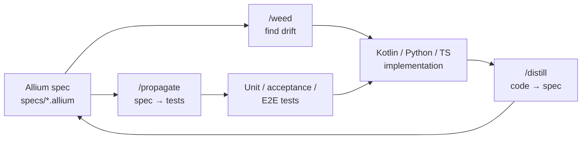

# How Kinetix Was Built

Kinetix is a multi-service institutional risk platform — Kotlin/Ktor microservices, a Python risk engine, a React/TypeScript UI, Kafka, TimescaleDB — built primarily through AI-assisted development. The working surface is Claude Code as the IDE, Allium as a DSL for behavioural specs, and a memory-and-agents system that lets one engineer plus an AI partner behave like a much larger team. This document is about how the *process* scales output: specs are the source of truth, tests are generated from specs, and a fleet of focused sub-agents handles the rest.

## Claude Code as the IDE

The terminal *is* the editor. There is no separate authoring tool — files are read, written, refactored, tested, and deployed from inside Claude Code. First-class slash-commands turn operational tasks into one-line invocations: `/health` checks every service, Kafka consumer, and database connection; `/incident` runs structured triage; `/demo` seeds realistic portfolios, trades, and market data; `/deploy` does a full rebuild-and-restart of the platform. Every action is reproducible because every action is a command, recorded in history and re-runnable.

## Allium: specs as source-of-truth

Allium is a DSL for behavioural specifications — entities, rules, triggers, surfaces, contracts — that captures *what* a system must do without prescribing *how*. In Kinetix, Allium specs live under `specs/` (see [`specs/README.md`](../specs/README.md) for the index) and are the contract that both implementation code and tests answer to. A spec describes a position-limit rule once; the Kotlin service, the Python pricer, and the Playwright E2E suite all derive from it. When requirements change, the spec changes first, and the rest of the system is forced into alignment. Specs are the smallest, most readable artefact in the repo, and they are the thing humans review.

## The /distill → /weed → /propagate loop

Three skills keep specs and code honest. `/distill` reads existing implementation and *extracts* behaviour into Allium — useful when code predates a spec, or when reverse-engineering a service. `/weed` audits every entity, rule, and trigger in a spec against the code, flagging drift: a rule with no enforcement site, a surface that returns fields the spec never declared, a trigger the code silently ignores. `/propagate` does the inverse direction — it generates property-based and state-machine tests directly from spec obligations, so the test suite is provably tied to the contract. The loop is never finished: every feature cycles through it, and the spec grows with the system rather than rotting beside it.

## /work-plan and /loop: autonomous execution

Multi-day work lives in markdown plans under `docs/plans/` with literal `- [ ]` checkboxes and per-item acceptance commands. `/work-plan` advances exactly one checkbox per invocation — it spawns a *fresh* subagent so the previous step's context never bloats the next one, executes the change, runs the acceptance command, ticks the box, and commits. Wrapping with `/loop` lets the system self-drive end-to-end through a plan of dozens or hundreds of items. This document was produced by exactly that pipeline.

## Sub-agents as on-demand domain experts

`.claude/agents/` holds 15 focused personas: `architect`, `quant`, `trader`, `qa`, `security-engineer`, `sre`, `dba`, `performance-engineer`, `compliance-officer`, `product-manager`, `data-analyst`, `ux-designer`, `tech-support`, plus the Allium-specific `weed` and `tend`. Each carries its own tone, tool allow-list, and operating context — the quant reaches for pricing-model literature, the SRE reaches for Grafana and Loki, the trader reasons about market microstructure. They are invoked via slash-commands (32 skills under `.claude/skills/`) or directly by the orchestrator when a task calls for a specific lens. The effect is a roster of senior consultants on call, each cheap to summon and consistent across sessions.

## Memory and worktrees

`.claude/memory/` persists user preferences, feedback, and project context across sessions — corrections given once stay corrected. Git worktrees under `.claude/worktrees/` give parallel agents isolated checkouts of the repo, so multiple branches of work proceed simultaneously without stomping each other. Together they turn one long-running collaboration into something durable and parallelisable rather than ephemeral chat.

## Further reading

- [`docs/evolution-report.md`](evolution-report.md) — chronological story of how the project grew
- [`docs/adr/README.md`](adr/README.md) — every architectural decision, indexed
- [`specs/README.md`](../specs/README.md) — the Allium spec index
- [`.claude/agents/`](../.claude/agents/) — sub-agent definitions
- [`.claude/skills/`](../.claude/skills/) — slash-command skills
