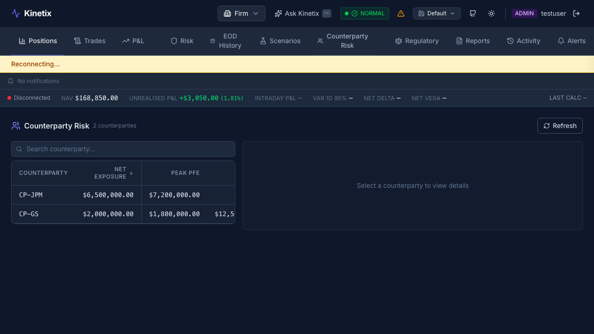

# Case study: Counterparty Risk — from spec to production

> **Flagship walkthrough.** One feature, traced end-to-end through the
> spec-driven AI loop, with the engineering judgement made explicit at
> each step. The point of this document is not "look how much the AI
> wrote." It is the opposite: to show *where the judgement lived*. The
> AI moved fast across the breadth of the change; the calls that made it
> correct — the deadline semantics, what degrades versus what is
> canonical, which states the UI must always reach — were mine.



## The requirement

The Counterparty Risk tab shows the firm's exposure to each counterparty,
merging two sources: the canonical risk-orchestrator snapshot, and
trade-derived placeholder rows enriched from `position-service` per book.
Behaviour for this lives in the spec, not in tribal knowledge:
[`specs/counterparty-risk.allium`](../../specs/counterparty-risk.allium)
(792 lines) defines the exposure entities, the merge, and — critically —
the terminal states the surface must reach.

Under demo trade volume the tab regressed to a **perpetual spinner**. That
is the worst failure mode for a risk screen: a trader cannot tell whether
exposure is genuinely zero or simply not loaded. Fixing it touched three
layers — gateway, UI data layer, UI surface — which is exactly the kind of
cross-cutting change where naive AI assistance produces three locally
plausible edits that don't add up to a correct whole.

## The loop

### 1. Spec first

The spec already named the contract: a counterparty-risk read **always**
returns the canonical snapshot rows; the trade-derived rows are
*best-effort* enrichment. That single distinction — canonical vs.
best-effort — is the hinge the whole fix turns on. It is a domain call (what
must a risk screen guarantee?), and it was settled in the spec before any
code changed.

### 2. `/weed` — find the divergence

The implementation had drifted from that contract. The gateway merge
([`gateway/.../routes/CounterpartyRiskRoutes.kt`](../../gateway/src/main/kotlin/com/kinetix/gateway/routes/CounterpartyRiskRoutes.kt))
fanned out to `position-service` **sequentially, per book, with no overall
deadline** — the per-call timeouts were swallowed by a broad `catch`. So a
slow enrichment fan-out blocked the canonical rows the spec says must
always be returned. The spec said "best-effort"; the code made it
load-bearing. That is a code bug, and `/weed` is what surfaces this class
of spec-vs-code drift.

### 3. Fix — and the judgement that made it correct

Three commits, each a deliberate decision:

- **`1d77e7b2` — client-side timeout (UI).** `authFetch` had no deadline,
  so a hung gateway hung the tab forever. Wrapped the counterparty reads in
  an `AbortController`-based **15s** timeout so a slow gateway surfaces the
  *existing* error banner. *Judgement: 15s is a product call — long enough
  to ride out a slow-but-working backend, short enough that a trader is
  never staring at a dead screen.*

- **`11f9d2c3` — bound and parallelise enrichment (gateway).** Wrapped
  `collectFirmTradeCounterparties` in `withTimeoutOrNull(enrichmentTimeoutMs)`
  and ran the per-book `getTradeHistory` calls **concurrently** inside a
  `coroutineScope` (`async { … }.awaitAll()`). The canonical snapshot rows
  are always returned; trade-derived rows are dropped if the fan-out
  exceeds the deadline. *Judgement: this is the spec's canonical-vs-best-effort
  distinction expressed in code. `withTimeoutOrNull` returns `null`
  rather than throwing — so a blown deadline degrades gracefully to "no
  enrichment" instead of failing the whole read. Total latency now tracks
  the slowest single book, not the sum.*

- **`c3ef7922` — pin the terminal states (UI e2e).** A Playwright test
  ([`ui/e2e/counterparty-risk-resilience.spec.ts`](../../ui/e2e/counterparty-risk-resilience.spec.ts))
  asserting the three states the tab must always reach: rows render on
  data, an empty payload shows the empty state, and a hung/failing gateway
  resolves to the **error banner — never a perpetual spinner**. *Judgement:
  "no stuck spinner, ever" is the actual acceptance criterion, and it only
  holds if proven at the browser level — a unit test on the hook cannot
  see a spinner.*

### 4. Tests at every level

The change carries unit tests on the data layer
([`ui/src/api/counterpartyRisk.test.ts`](../../ui/src/api/counterpartyRisk.test.ts),
[`ui/src/hooks/useCounterpartyRisk.test.ts`](../../ui/src/hooks/useCounterpartyRisk.test.ts))
*and* the browser-level resilience e2e — per the project's rule that unit
tests alone never suffice for a UI workflow.

## What stayed human

The AI wrote the coroutine plumbing, the AbortController wiring, and the
Playwright scaffolding quickly and correctly. What it did **not** decide:

- **The contract** — that canonical rows are guaranteed and enrichment is
  best-effort. That is the domain judgement the entire fix hangs on, and it
  was fixed in the spec.
- **The degradation semantics** — `withTimeoutOrNull` (degrade to null), not
  a throw that fails the read. Choosing graceful degradation over
  fail-closed here is a risk-product call.
- **The numbers** — a 15s client deadline and a server enrichment budget
  are product choices about what a trader should tolerate.
- **The acceptance criterion** — "never a stuck spinner" as the property
  worth pinning at the browser level.

That is the division this whole project runs on: the AI supplies breadth
and speed; I supply the judgement that makes the result *correct for a
risk system*. The spec is where that judgement is written down so it
survives the next change.

## Trace it yourself

```bash
git log --grep=kx-qfqn --format="%h %s"          # the three commits
allium check specs/counterparty-risk.allium      # the spec, validated
cd ui && npx playwright test counterparty-risk-resilience   # the terminal states
```

See also the [case-study index](README.md), the
[limits vignette](limits.md), and the [audit vignette](audit.md).
