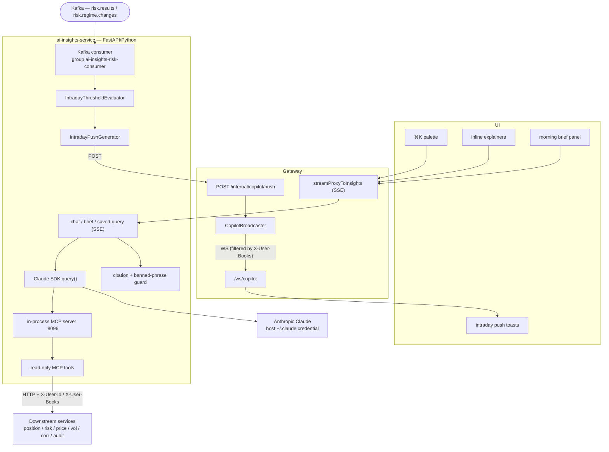
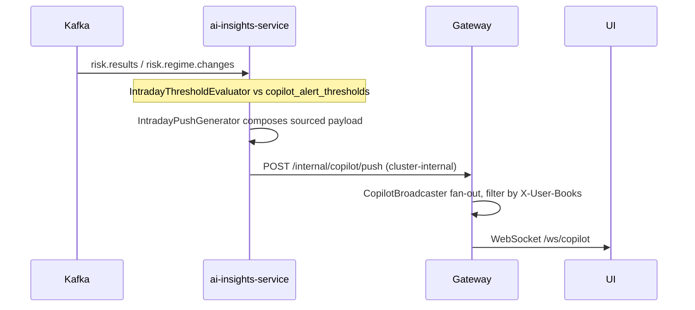

# AI Copilot architecture (v2)

The v2 Copilot (ADR-0036) lives entirely inside `ai-insights-service` (FastAPI/Python): a Claude SDK conversation grounded in Kinetix data via an **in-process MCP server** (internal port 8096, never exposed through the gateway). Four user surfaces share the machinery — morning brief, intraday push, inline explainers, and the ⌘K palette. Write actions are out of scope. Consult this when touching any copilot surface, the MCP tool registry, or the streaming proxy.

## Components

## Intraday push sequence

Last regenerated: 2026-06-02 @ `1023b46b`

Source signals: ADR-0036 (AI Copilot architecture v2), `specs/ai-insights.allium`, `docker-compose.services.yml` (ai-insights-service, port 8096), ADR-0013 (Keycloak JWT → service-principal headers), ADR-0016 (broadcaster pattern).
