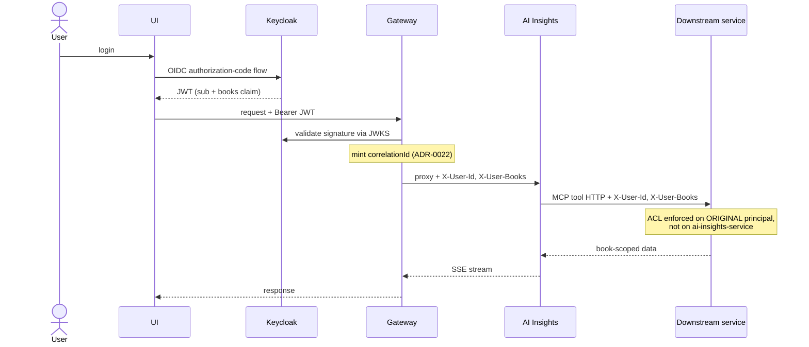

# Auth flow — JWT + service-principal

How identity flows from Keycloak login through the gateway to downstream services, including the service-principal pattern (ADR-0036) that keeps the original user as the principal of every AI tool call — so ACLs are enforced downstream and the audit trail stays honest. Consult this when touching auth, the gateway proxy headers, or per-book ACL enforcement.

Last regenerated: 2026-06-02 @ `c3ef7922`

Source signals: ADR-0013 (Keycloak auth & RBAC), ADR-0036 (service-principal `X-User-Id` / `X-User-Books`), ADR-0022 (correlation-id propagation), ADR-0012 (gateway aggregation), `gateway/Application.kt` (JwtConfig, BookAccessService, requirePermission).
