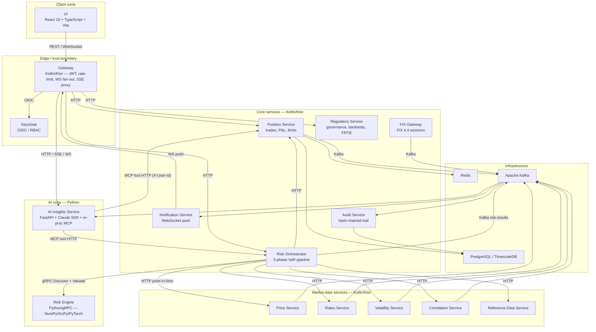

# C4 — Container

Every Kinetix service as a container, grouped by trust zone, with technology labels and the dominant transport between them. Consult this when deciding where new code belongs or how two services communicate. Synchronous calls (HTTP/gRPC) and asynchronous events (Kafka) are both shown; the full Kafka wiring is in [kafka-topology](kafka-topology.md).

Last regenerated: 2026-06-02 @ `c3ef7922`

Source signals: `settings.gradle.kts` (module list), `README.md` (Services in depth, Architecture), ADR-0012 (gateway aggregation), ADR-0024/0029 (unified Valuate, discovery-valuation), ADR-0036 (AI copilot, in-proc MCP, service-principal). Database-per-service per ADR-0011 — only representative Postgres/Redis edges drawn to keep the diagram legible.
