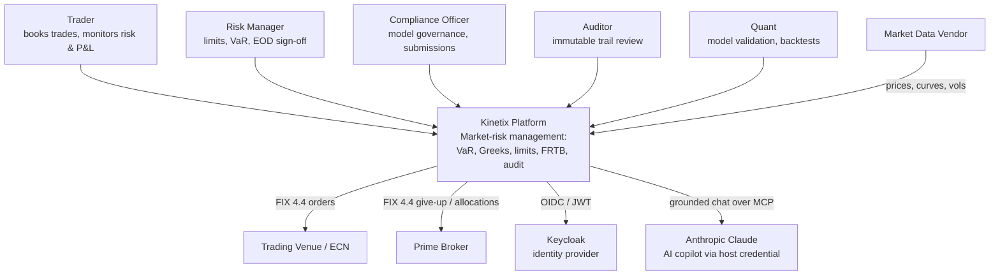

# C4 — System Context

Kinetix as a single black box, showing the human actors who use it and the external systems it integrates with. Consult this when you need the 10,000-foot view: who depends on the platform and what it talks to across its trust boundary. For the internals, see [c4-container](c4-container.md).

Last regenerated: 2026-06-02 @ `1023b46b`

Source signals: `README.md` (At a glance, Architecture), `docs/wiki/Architecture.md`, ADR-0013 (Keycloak), ADR-0035 (FIX gateway extraction), ADR-0036 (AI copilot — host credential, no API key).
