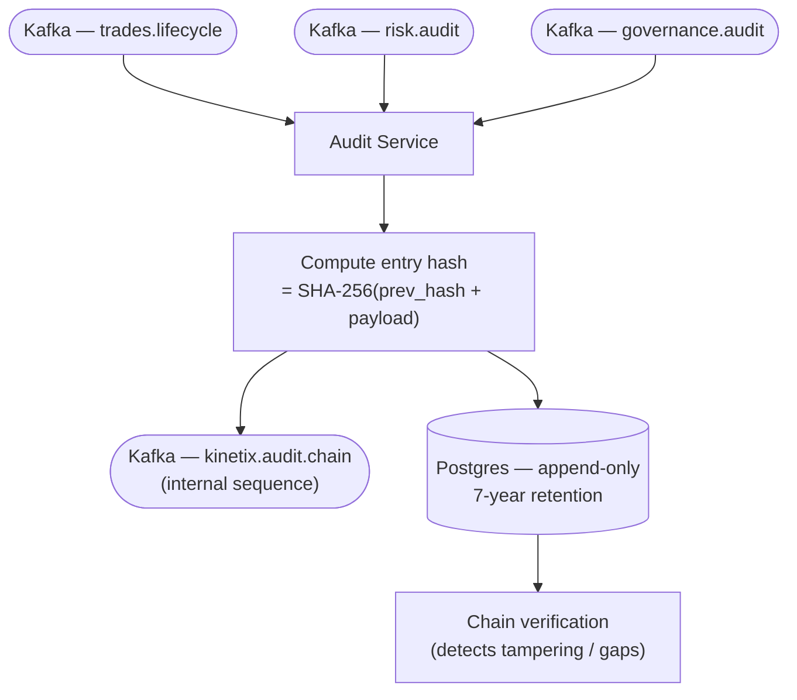

# Data flow — Audit event

How heterogeneous events become tamper-evident records in the hash-chained audit trail (ADR-0017). Multiple producers feed the audit-service, which links each entry to the previous via a SHA-256 hash and persists it to an append-only, 7-year-retention Postgres store. Consult this when adding an auditable event source or reasoning about chain integrity.

Last regenerated: 2026-06-02 @ `1023b46b`

Source signals: ADR-0017 (hash-chained audit trail), `docs/wiki/Audit-and-Compliance.md`, Kafka topic literals (`governance.audit`, `risk.audit`, `kinetix.audit.chain`), `docs/wiki/Architecture.md` (audit event fork).
