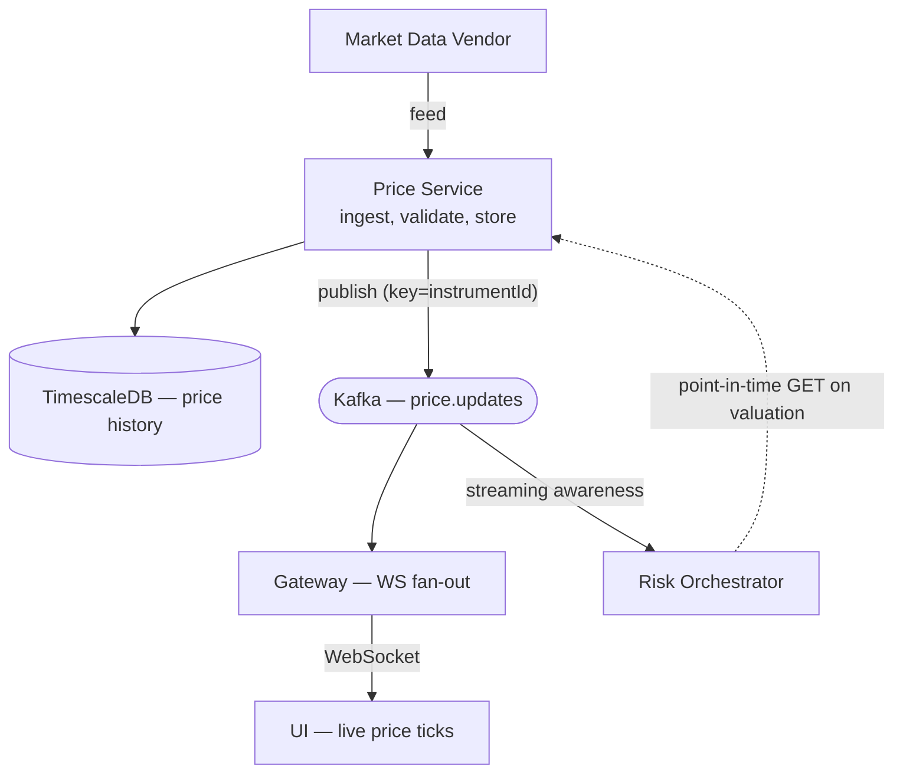

# Data flow — Price update

A market-data price update from ingestion to the two things it drives: a live UI tick (WebSocket fan-out) and a risk recalculation. Note the orchestrator consumes prices from Kafka for *streaming awareness* but fetches point-in-time snapshots over HTTP for an actual valuation (ADR-0021) — the two paths are distinct.

Last regenerated: 2026-06-02 @ `c3ef7922`

Source signals: `price-service/kafka/KafkaPricePublisher.kt` (topic `price.updates`, key=instrumentId), `risk-orchestrator/Application.kt` (`PriceEventConsumer` consumes `price.updates`; `HttpPriceServiceClient` fetches point-in-time), `gateway/kafka/KafkaIntradayPnlConsumer.kt` + `DevModule.kt` (gateway consumes `price.updates` for WS fan-out), ADR-0005 (TimescaleDB), ADR-0021 (point-in-time fetch), ADR-0016 (WebSocket).
