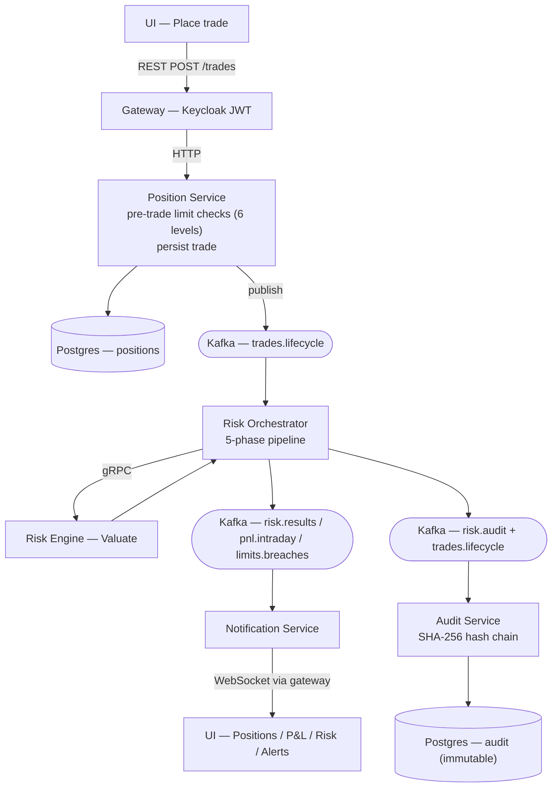

# Data flow — Trade

A trade from the UI click to the risk update landing back on screen, including the pre-trade limit checks (ADR-0023), the Kafka hop, and the audit fork. Consult this to understand what touches a trade and in what order.

Last regenerated: 2026-06-02 @ `1023b46b`

Source signals: `docs/wiki/Architecture.md` (trade booking → risk update), ADR-0023 (hierarchical limits), ADR-0021 (orchestration), ADR-0017 (audit chain), Kafka topic literals (`trades.lifecycle`, `risk.results`, `risk.audit`).
