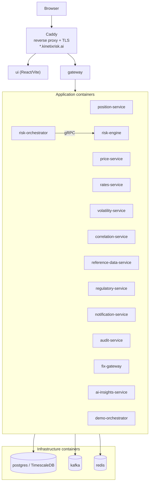

# Deployment topology (local / demo)

How the platform runs locally via Docker Compose: a Caddy reverse proxy fronts the UI and gateway, all services and the shared infrastructure run as containers on one network. Compose files: `docker-compose.services.yml` (services) + `infra/docker-compose.infra.yml` (Postgres, Kafka, Redis) + `infra/docker-compose.observability.yml`. Consult this for local-dev wiring; production hosting decisions live elsewhere.

Last regenerated: 2026-06-02 @ `c3ef7922`

Source signals: `docker-compose.services.yml` (service + caddy + ui containers), `infra/docker-compose.infra.yml` (postgres, kafka, redis), `CLAUDE.md` (local URLs, redeploy.sh), `settings.gradle.kts` (module list). Deployment is Docker Compose (not Kubernetes) per project conventions.
