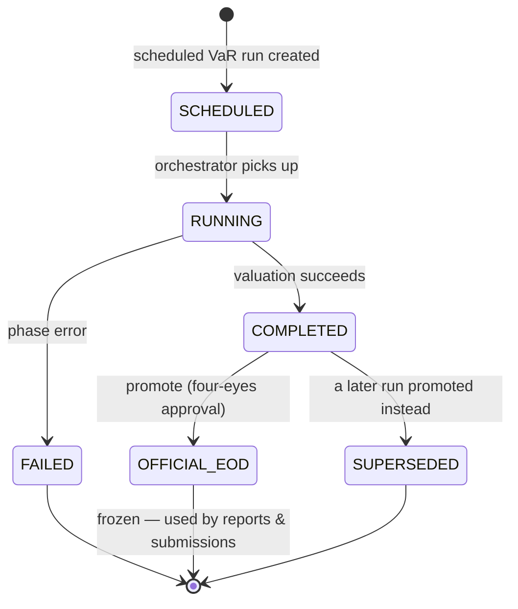

# EOD promotion lifecycle

The state machine for promoting a risk run to the official end-of-day number (ADR-0019). Scheduled runs land as `SCHEDULED`; once complete they are eligible for promotion to `OFFICIAL_EOD` under a four-eyes rule. Reports and regulatory submissions reference promoted runs only, so EOD numbers are frozen and non-racy. Consult this when touching run labelling, promotion governance, or report sourcing.

Last regenerated: 2026-06-02 @ `c3ef7922`

Source signals: ADR-0019 (official EOD labelling with promotion governance), `risk-orchestrator/kafka/KafkaOfficialEodPublisher.kt` (topic `risk.official-eod`), `risk-orchestrator/service/EodPromotionService.kt` (promotion logic), `demo-orchestrator/kafka/OfficialEodConsumer.kt` (consumer), `regulatory-service` (consumes `risk.official-eod` for submission anchoring).
