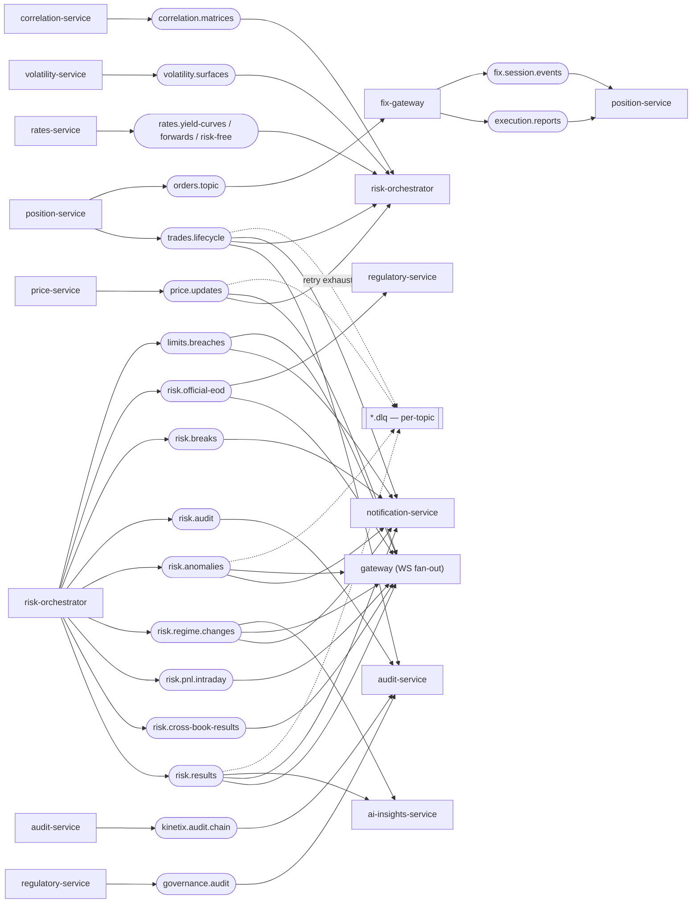

# Kafka topology

Producers (left) → topics (centre) → consumers (right) for the 20 production topics. Every topic has a `.dlq` counterpart; consumers wrap in a `RetryableConsumer` with bounded retries before routing to the DLQ (ADR-0014). Consult this when adding a topic, producer, or consumer, or when tracing event fan-out. Test-suffixed topics (`*.test-1`, `*.e2e`, …) are omitted.

Last regenerated: 2026-06-02 @ `1023b46b`

Source signals: `grep -rhoE '"[a-z]+\.[a-z0-9.-]+"' --include=*.kt` across services (topic literals), `docs/wiki/Architecture.md` (Kafka topic → producer/consumer/partition-key table), ADR-0004 (Kafka), ADR-0014 (DLQ + RetryableConsumer), ADR-0036 (ai-insights consumes `risk.results` + `risk.regime.changes`).
