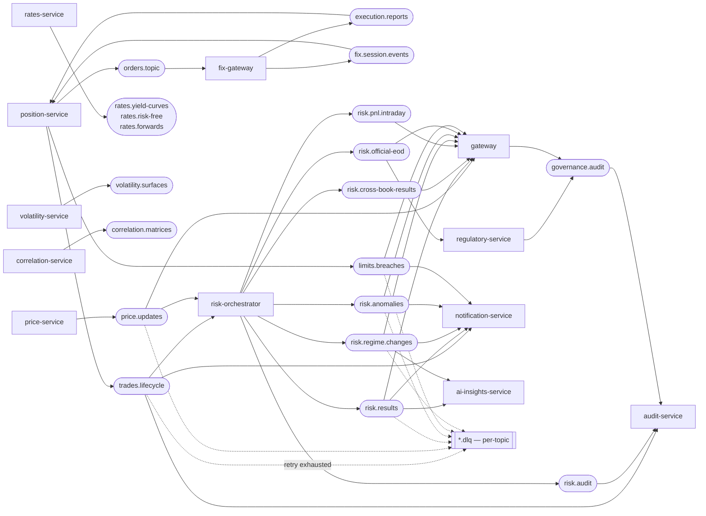

# Kafka topology

Producers (left) → topics (centre) → consumers (right) for the production topics. Every topic has a `.dlq` counterpart; consumers wrap in a `RetryableConsumer` with bounded retries before routing to the DLQ (ADR-0014). Consult this when adding a topic, producer, or consumer, or when tracing event fan-out. Test-suffixed topics are omitted.

Note: `rates.yield-curves`, `rates.risk-free`, `rates.forwards`, `volatility.surfaces`, and `correlation.matrices` are published to Kafka but the risk-orchestrator fetches these point-in-time over HTTP rather than consuming from Kafka — no Kafka consumer exists for those five topics.

Last regenerated: 2026-06-02 @ `c3ef7922`

Source signals: Topic literals from `grep -rn "topic\s*=\s*\""` across all service `src/main/kotlin` directories; `KafkaRatesPublisher.kt`, `KafkaVolatilityPublisher.kt`, `KafkaCorrelationPublisher.kt` (topic names); `notification-service/Application.kt` (consumers: `risk.results`, `risk.anomalies`, `limits.breaches`, `risk.regime.changes`); `audit-service/Application.kt` (consumers: `trades.lifecycle`, `governance.audit`); `risk-orchestrator/Application.kt` (consumers: `trades.lifecycle`, `price.updates`; publishers: `risk.results`, `risk.cross-book-results`, `risk.pnl.intraday`, `risk.regime.changes`, `risk.audit`, `risk.official-eod`, `risk.anomalies`); `ai-insights-service/src/kinetix_insights/push/kafka_consumer.py` (consumers: `risk.results`, `risk.regime.changes`); `gateway/DevModule.kt` (consumer: `risk.pnl.intraday`); ADR-0004 (Kafka), ADR-0014 (DLQ + RetryableConsumer), ADR-0036 (ai-insights Kafka consumption).
