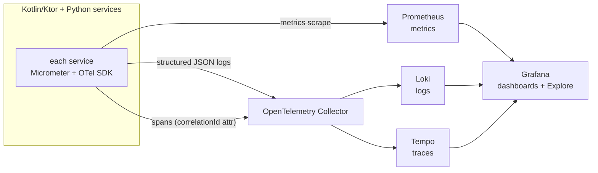

# Observability stack

The three telemetry signals and where they land (ADR-0008): metrics via Micrometer → Prometheus, structured logs via the OpenTelemetry Collector → Loki, traces via the OTel SDK → Tempo — all visualised in Grafana. A `correlationId` minted at the gateway (ADR-0022) threads through HTTP, Kafka headers, gRPC metadata, and audit rows, so one Tempo/Grafana query stitches UI click → API call → Kafka event → risk run → audit chain.

Last regenerated: 2026-06-02 @ `c3ef7922`

Source signals: ADR-0008 (Grafana stack — Prometheus + Loki + Tempo), ADR-0022 (correlation-id propagation), `infra/docker-compose.observability.yml`, `deploy/observability/`, `common/observability/OtelInit.kt` + `CorrelationIdHttpServerPlugin.kt` (OTel instrumentation in every service).
