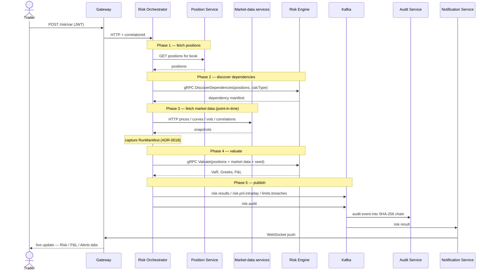

# Risk-flow — VaR run sequence

A single VaR run end-to-end, showing the risk-orchestrator's five sequential phases (ADR-0021) and the discovery-valuation two-phase gRPC contract with the pure-calculator risk engine (ADR-0029). Consult this when changing the orchestration pipeline, the engine contract, or the publish/notify fan-out.

Last regenerated: 2026-06-02 @ `1023b46b`

Source signals: ADR-0021 (5-phase orchestration), ADR-0029 (discovery-valuation), ADR-0024 (unified Valuate RPC), ADR-0018 (run manifests), ADR-0017 (hash-chained audit), `docs/wiki/Architecture.md` (trade booking → risk update flow).
