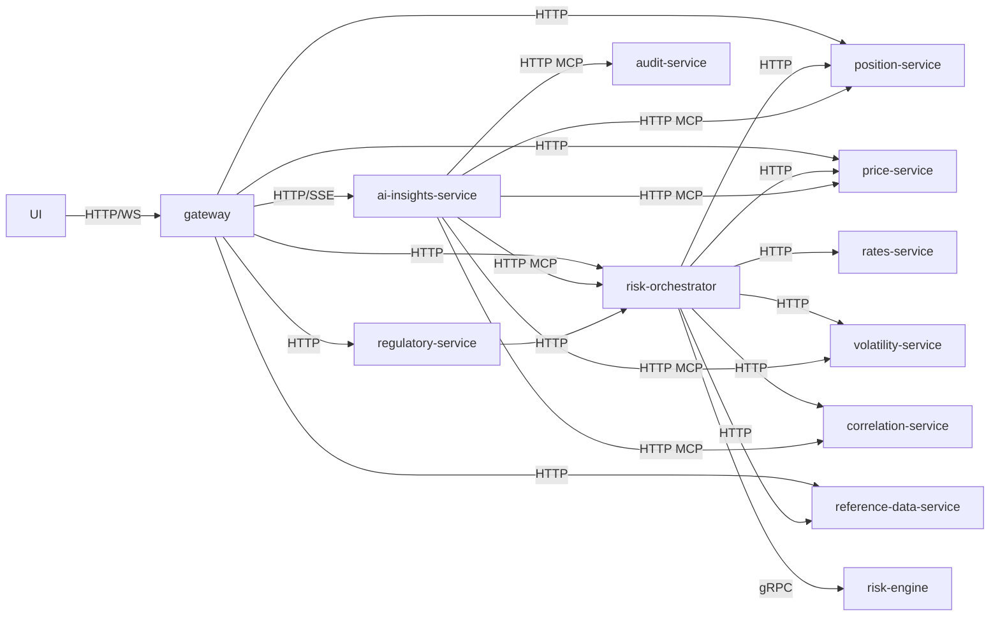

# Service dependency graph (synchronous)

The synchronous request/response dependencies only — HTTP and gRPC — with Kafka deliberately excluded so the call-time coupling is visible. An arrow `A --> B` means "A calls B and waits." Use this to assess blast radius: what breaks if B is down, and which services must be up to serve a given request. For the asynchronous picture, see [kafka-topology](kafka-topology.md).

Last regenerated: 2026-06-02 @ `c3ef7922`

Source signals: ADR-0012 (gateway aggregation), ADR-0021 (orchestrator HTTP clients in `risk-orchestrator/Application.kt`: `HttpPositionServiceClient`, `HttpPriceServiceClient`, `HttpRatesServiceClient`, `HttpVolatilityServiceClient`, `HttpCorrelationServiceClient`, `HttpReferenceDataServiceClient`), ADR-0024/0029 (gRPC to risk-engine), ADR-0036 (ai-insights MCP tool targets). Kafka edges intentionally omitted — see kafka-topology.
