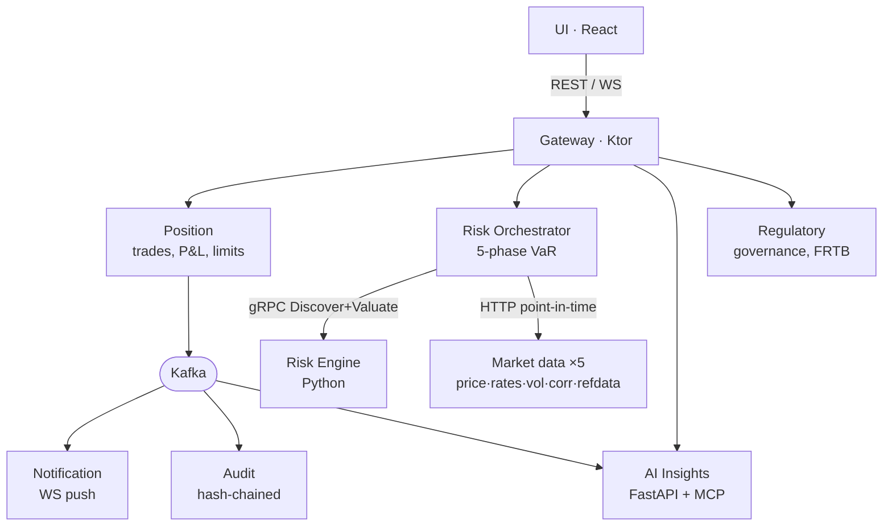

<!--
Speaker deck for the 30-minute talk. Outline & speaker notes: building-kinetix-with-ai-30m.md
Render:  npx @marp-team/marp-cli docs/talks/building-kinetix-with-ai-30m.deck.md -o deck.html
PDF:     npx @marp-team/marp-cli docs/talks/building-kinetix-with-ai-30m.deck.md --pdf
Mermaid slides need the marp mermaid plugin, or replace with a static export of docs/diagrams/c4-container.md.
Speaker notes live in HTML comments under each slide (visible in Marp presenter view).
-->

# Specs Are the<br/>New Source Code

#### How one engineer built a 450k-line<br/>regulated risk platform with AI

<br/>

**Yavor Panayotov** · contracting through JUXT

<!--
Not a "clever prompt" talk. A workflow that let one contractor build what normally takes a team a year.
Everything is in a real repo, real commit history. No staged screenshots.
-->

---

## The takeaway, up front

> When behaviour lives in **executable specs**,
> AI stops being autocomplete and becomes an **implementer** —
>
> and one engineer can keep a 13-service, 453k-line
> **regulated** platform aligned across
> Kotlin, Python & TypeScript.

<!-- Greyed/held mentally until the close — but plant it now so they know where we're going. -->

---

<!-- _class: invert lead -->

# 453,407

### lines of production code · **25** specs · **1** person

<!--
Open on the artefact: Kinetix, a market-risk platform. 13 services. VaR, Greeks, hash-chained audit, regulatory submissions, an AI copilot.
Then the honest caveat IMMEDIATELY — this is where credibility is won.
-->

---

## The honest caveat (now, not later)

AI wrote most of the code.

It did **not**:

- make the architecture decisions
- validate the quant maths
- sign off the regulatory logic

**I'll show you exactly where the line is.**

<!-- Say this in the first 2 minutes. Over-disclosing here is what makes 453k believable. -->

---

## Why this is hard

Risk software is **behaviour-dense**, not feature-dense.

The hard part isn't screens — it's *rules*:

- *"reject a trade when the position limit is breached"*
- *"every audit record chains to the previous hash"*
- *"VaR adapts when the regime flips to crisis"*

<!-- Set up the real question: not "can AI write code" but "how do you keep 453k lines from rotting". -->

---

## Three ways naive AI builds fail

| Failure | What it looks like |
|---|---|
| **Drift** | change one service; the proto + test elsewhere silently disagree — ×13 |
| **Plausible-but-wrong** | a VaR function that *looks* right and is subtly, dangerously incorrect |
| **No source of truth** | behaviour lives only in code + your memory; nothing checks the AI |

<!-- You become bottleneck AND single point of failure. The fix has to be a checkable definition of correct. -->

---

## The fix: behaviour lives in **specs**, not code

```allium
entity AuditEvent {
  sequence_number : Int
  payload         : Json
  previous_hash   : Hash
  record_hash     : Hash
}

rule chain_integrity {
  record_hash == sha256(payload ++ previous_hash)
}
```

<small>`specs/audit.allium` — reads like a design doc, checkable like code</small>

<!-- CLAUDE.md's one rule that changes everything: behaviour is defined in specs, not in code. -->

---

## One spec → many targets

The spec is the **source code**.
Everything else is a **compilation target** the AI keeps in sync.

```
specs/audit.allium
        │
        ├──▶  AuditHasher.kt        (implementation)
        ├──▶  generated tests       (coverage tied to the contract)
        ├──▶  audit.proto           (the wire contract)
        └──▶  ADR-0017              (decision cites the spec by line)
```

<!-- The AI does the fan-out. You own the spec. -->

---

## The workflow — three verbs

| `/distill` | reverse-engineer a spec **from** code |
|---|---|
| **`/weed`** | find divergences between spec & code — *your drift CI* |
| `/propagate` | generate tests **from** the spec |

<br/>

**Change the spec first. Then propagate to code and tests.**

<!-- /weed is the safety net that spans services. /propagate means the spec writes the test, not your memory. -->

---

## What the method produced

<div style="font-size: 0.7em">



</div>

<!-- 13 services, real infra. Full diagram: docs/diagrams/c4-container.md. These were MY architecture calls; AI built them. -->

---

## Four decisions worth bragging about

- **Discovery–Valuation (ADR-0029)** — risk engine is a *pure calculator*: declares what data it needs, then is handed it. Reproducible, decoupled.
- **Hash-chained audit (ADR-0017)** — tamper-evident chain over every action; incremental verification.
- **Run manifests (ADR-0018)** — input/output digests + model version + seed → same inputs, same answer. *What a regulator asks.*
- **AI Copilot (ADR-0036)** — grounded LLM over a read-only MCP server; citation checks so it can't hallucinate a number.

<!-- Architecture is judgement. Judgement stayed with me — helped by 'quant'/'trader'/'SRE' agent personas. Deployment is docker-compose, not K8s. -->

---

<!-- _class: invert lead -->

# Live demo

### change a rule → watch it propagate

<!--
Pick a one-sentence limits rule. Narrate every command before enter.
At /weed divergence: "THAT'S the safety net."  At green: "I didn't write that test. The spec did."
Fallback: <<LOOM_LINK>> + 4 screenshots. If network dies, walk the screenshots — no apology.
-->

---

## The demo, in five steps

1. Edit one rule in `specs/limits.allium` *(add a soft-breach band)*
2. `/weed` → *"spec declares behaviour the code doesn't enforce"*
3. `/propagate` → a failing test, named like a sentence
4. Run module tests → **red**
5. Implement the minimal change → **green**

<br/>

> **I changed the spec. The test wrote itself.<br/>The code had nowhere to hide.**

---

## What AI got wrong

| AI **did** | Human **kept** |
|---|---|
| boilerplate, cross-cutting rollouts | **architecture** — every boundary, every ADR |
| 11 services instrumented in one session | **quant correctness** — AI is not a model validator |
| test generation from specs | **regulatory nuance** — 95%-right is a *fail* |
| breadth per session | **integration stability** — real Kafka/Postgres caught what units missed |

<small>602 prompts · 126 sessions · ~4.7-min median cadence. **Driven, not autopilot.**</small>

<!-- Slow down here. This slide is the credibility. Make the right column look valuable, not residual. -->

---

## The takeaway

> The **bottleneck moves up the stack.**

AI didn't make me a faster typist —
it made the **specification** the thing I spend time on.

<br/>

You don't need Allium. You need *a single checkable
definition of correct behaviour* both you and the AI
are accountable to. **The discipline scales, not the tool.**

<!-- Re-land "25 specs". Soft CTA: I build this way through JUXT — come find me. -->

---

<!-- _class: invert lead -->

# Thank you

**Yavor Panayotov** · JUXT

Questions → and find me after for a live repo walk-through

<!--
Anticipate: "vs TDD?" · "does it scale past one person?" · "trust AI in regulated domains?"
· "isn't 453k just bloat?" (redirect to 25 specs) · "vs Copilot/Cursor?"
Redirect VaR-maths / vendor tangents: "happy to go deep offline — this talk is about the method."
-->
