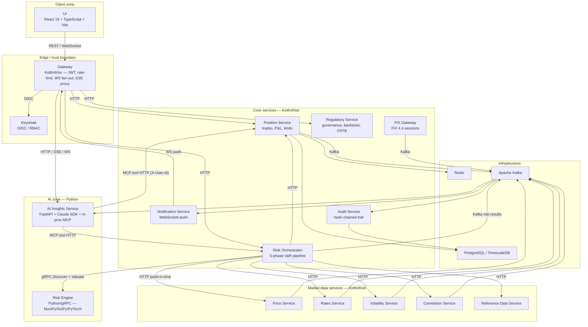
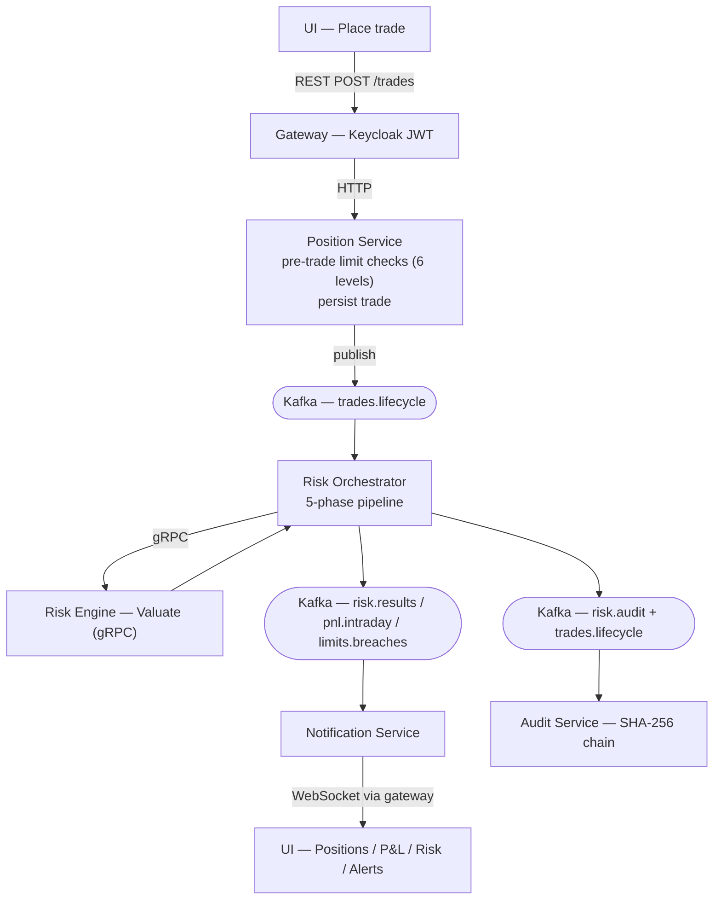

# Architecture

Kinetix is a polyglot microservices monorepo. The system is split into 12 Kotlin/Ktor services, a Python quantitative engine, and a React UI. Communication is event-driven over Kafka where state-change distribution matters, request/response over HTTP at the gateway boundary, and gRPC across the Kotlin↔Python boundary where call latency matters and contracts are tight.

## Topology

## Communication patterns

| Pattern | When used | ADR |
|---|---|---|
| REST / WebSocket | UI ↔ gateway. Stateless reads and writes; WebSocket for price ticks, intraday P&L, regime changes, alerts. | [0012](https://github.com/panayotovk/kinetix/blob/main/docs/adr/0012-api-gateway-aggregation-pattern.md), [0016](https://github.com/panayotovk/kinetix/blob/main/docs/adr/0016-websocket-for-real-time-ui-updates.md) |
| HTTP (gateway → backend) | Gateway aggregates backend service responses for UI calls. | [0012](https://github.com/panayotovk/kinetix/blob/main/docs/adr/0012-api-gateway-aggregation-pattern.md) |
| Kafka | Event distribution across services — trades, executions, prices, risk results, alerts, audit. | [0004](https://github.com/panayotovk/kinetix/blob/main/docs/adr/0004-kafka-for-async-messaging.md) |
| gRPC | Kotlin ↔ Python (risk engine), and Kotlin ↔ Kotlin where unified valuation, FRTB, factor, and counterparty calculations are called synchronously. | [0003](https://github.com/panayotovk/kinetix/blob/main/docs/adr/0003-grpc-for-python-integration.md), [0024](https://github.com/panayotovk/kinetix/blob/main/docs/adr/0024-unified-valuation-rpc.md) |

## Kafka topics (production)

20 production topics with per-topic DLQs. Partition keys chosen for ordering or aggregation locality.

| Topic | Producer | Consumers | Partition key |
|---|---|---|---|
| `trades.lifecycle` | position-service | audit, risk-orchestrator, notification | tradeId |
| `execution.reports` | fix-gateway | position-service | clOrdId |
| `fix.session.events` | fix-gateway | position-service, observability | sessionId |
| `orders.topic` | position-service | fix-gateway | orderId |
| `price.updates` | price-service | risk-orchestrator, gateway (WS fan-out) | instrumentId |
| `rates.yield-curves` | rates-service | risk-orchestrator | curveId |
| `rates.forwards` | rates-service | risk-orchestrator | curveId |
| `rates.risk-free` | rates-service | risk-orchestrator | currency |
| `volatility.surfaces` | volatility-service | risk-orchestrator | underlying |
| `correlation.matrices` | correlation-service | risk-orchestrator | matrixId |
| `risk.results` | risk-orchestrator | gateway, notification | bookId |
| `risk.cross-book-results` | risk-orchestrator | gateway | hierarchyKey |
| `risk.pnl.intraday` | risk-orchestrator | gateway (WS fan-out) | bookId |
| `risk.regime.changes` | risk-orchestrator | notification, gateway | regimeKey |
| `risk.anomalies` | risk-orchestrator | notification, gateway | anomalyType |
| `risk.audit` | risk-orchestrator | audit-service | runId |
| `risk.breaks` | risk-orchestrator | notification | breakType |
| `risk.official-eod` | risk-orchestrator | gateway, regulatory | bookId |
| `limits.breaches` | risk-orchestrator | notification, gateway | breachType |
| `governance.audit` | regulatory-service | audit-service | eventId |
| `kinetix.audit.chain` | audit-service | (internal chain) | sequenceId |

Every topic has a `.dlq` counterpart. Consumers wrap in a `RetryableConsumer` ([ADR-0014](https://github.com/panayotovk/kinetix/blob/main/docs/adr/0014-resilience-patterns-dlq-circuit-breaker.md)) with bounded retries before DLQ.

## Data flows

### Trade booking → risk update

> Rendered version with storage nodes: [`docs/diagrams/data-flow-trade.md`](https://github.com/panayotovk/kinetix/blob/main/docs/diagrams/data-flow-trade.md). For the phase-by-phase gRPC sequence (discovery + valuation), see [`docs/diagrams/risk-flow.md`](https://github.com/panayotovk/kinetix/blob/main/docs/diagrams/risk-flow.md).

The same path ships an audit event via `risk.audit` and `trades.lifecycle.audit` to audit-service, which chains it into the SHA-256 audit log.

### Reproducibility — run manifests

Every risk run captures a manifest ([ADR-0018](https://github.com/panayotovk/kinetix/blob/main/docs/adr/0018-run-reproducibility-via-manifests.md)):

- Run ID, parent run, valuation timestamp
- Snapshot of position set
- Snapshot of all market data used (prices, curves, vol surfaces, correlations)
- Monte Carlo seed
- Model and code version (git SHA)
- Output hash

Replaying a manifest produces a byte-identical result. This is the foundation for:

- VaR backtesting against historical positions
- "Compare runs" feature in the UI
- Regulator-grade reproducibility on audit demand
- Confidence in model migrations — diff old vs. new models on identical inputs

### EOD promotion

Scheduled VaR runs land with label `SCHEDULED`. A separate promotion action ([ADR-0019](https://github.com/panayotovk/kinetix/blob/main/docs/adr/0019-official-eod-labeling-with-promotion-governance.md)) flips a completed run to `OFFICIAL_EOD`, subject to a four-eyes rule. Reports and regulatory submissions reference promoted runs only, so end-of-day numbers are frozen and non-racy.

## Cross-cutting concerns

### Correlation ID propagation ([ADR-0022](https://github.com/panayotovk/kinetix/blob/main/docs/adr/0022-correlation-id-propagation.md))

A UUID `correlationId` is minted at the gateway on every inbound request, propagated through every HTTP call, every Kafka header, every gRPC metadata, and every audit row. A single Grafana/Tempo query stitches together UI click → API call → Kafka event → risk run → audit chain.

### Observability ([ADR-0008](https://github.com/panayotovk/kinetix/blob/main/docs/adr/0008-grafana-stack-for-observability.md))

- **Metrics:** Micrometer → Prometheus. Per-service dashboards plus cross-cutting (risk run duration, Kafka lag, DLQ depth).
- **Logs:** structured JSON, shipped via OpenTelemetry Collector → Loki.
- **Traces:** OpenTelemetry SDK → Tempo. Correlation IDs in span attributes for cross-tier joins.

### Resilience ([ADR-0014](https://github.com/panayotovk/kinetix/blob/main/docs/adr/0014-resilience-patterns-dlq-circuit-breaker.md))

- **Kafka:** `RetryableConsumer` wraps every consumer, bounded retries before DLQ; DLQ replay tooling for ops.
- **HTTP:** Resilience4j circuit breakers around inter-service calls; bulkhead isolation per dependency.
- **gRPC:** retry policy on idempotent RPCs; deadlines on every call.

### Scaling ([ADR-0026](https://github.com/panayotovk/kinetix/blob/main/docs/adr/0026-hpa-scaling-metrics.md))

Horizontal Pod Autoscaler on every Kotlin service:

- All services: CPU and memory.
- Consumer-heavy services (risk-orchestrator, notification): Kafka consumer lag as a custom metric.
- Risk engine: queue depth + p99 latency.
