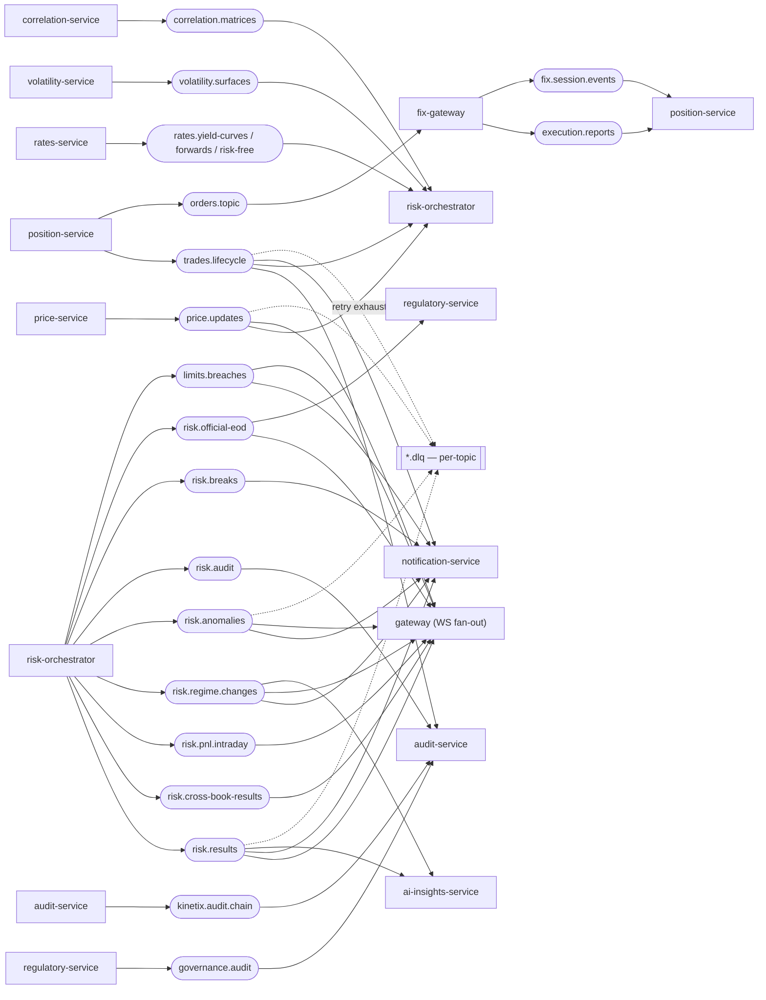

# Kafka Topology

Kinetix uses Apache Kafka (KRaft mode) as the event backbone — 20 production topics, each with a `.dlq` counterpart. Every consumer wraps in a `RetryableConsumer` ([ADR-0014](https://github.com/panayotovk/kinetix/blob/main/docs/adr/0014-resilience-patterns-dlq-circuit-breaker.md)) with bounded retries before routing to the DLQ. Partition keys are chosen for ordering or aggregation locality.

This page is the rendered counterpart to the producer/consumer table on the [Architecture](Architecture) page. The diagram source lives at [`docs/diagrams/kafka-topology.md`](https://github.com/panayotovk/kinetix/blob/main/docs/diagrams/kafka-topology.md) and is regenerable with `/diagrams kafka`.

## Resilience

- **Bounded retries → DLQ.** `RetryableConsumer` retries a configurable number of times, then routes the poisoned message to the topic's `.dlq`. Ops tooling can replay from the DLQ once the cause is fixed.
- **Ordering.** Partition keys (`tradeId`, `instrumentId`, `bookId`, …) preserve per-entity ordering where it matters.
- **Correlation.** Every Kafka message carries the `correlationId` header ([ADR-0022](https://github.com/panayotovk/kinetix/blob/main/docs/adr/0022-correlation-id-propagation.md)) so an event can be stitched to its originating UI click and risk run in Tempo.

See also: [Architecture](Architecture) · [Observability](Observability)
